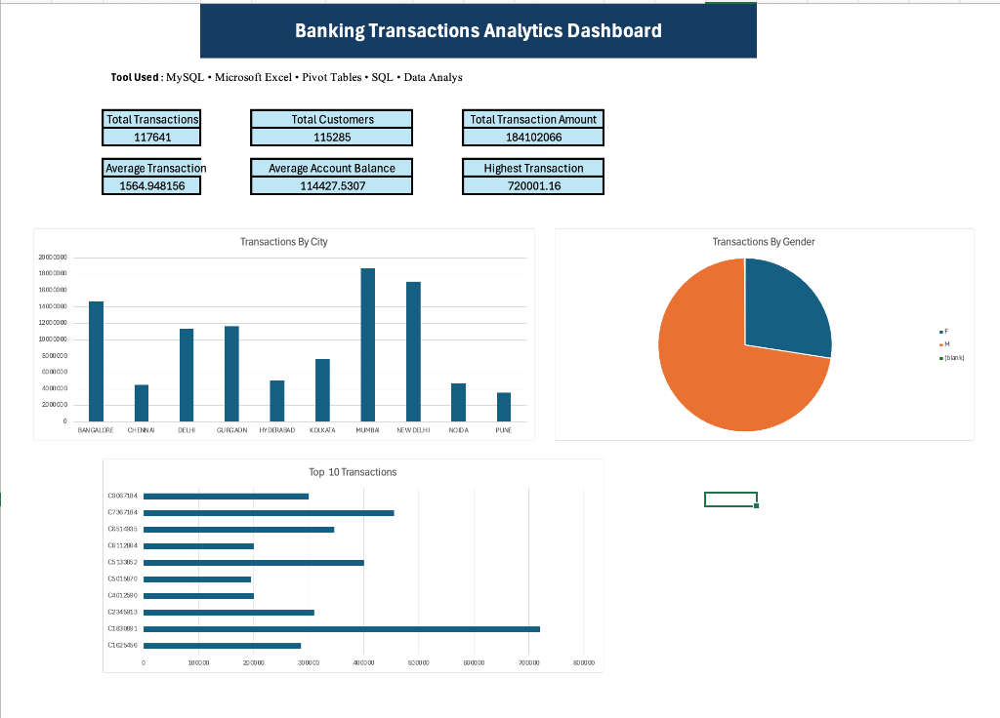

# 🏦 Banking Transaction Analysis & Dashboard

An end-to-end Data Analytics project analyzing customer banking transactions, account balances, and regional banking activity using **MySQL** and **Microsoft Excel**.

---

## 📊 Dashboard Visual Preview



---

## 📌 Project Overview
This project provides a comprehensive analysis of over **117,000+ banking transactions** across **115,285 customers** to evaluate customer behavior, high-value transaction distributions, regional financial performance, and gender demographics. The final deliverable includes an interactive Excel dashboard with pivot tables, dynamic charts, and executive KPI summaries.

---

## 🛠️ Tools & Methods
`MySQL` • `Microsoft Excel` • `Pivot Tables` • `SQL Queries` • `Data Analysis`

---

## 📊 Key Performance Indicators (KPIs)
* **Total Transactions Analyzed:** `117,641`
* **Total Customers:** `115,285`
* **Total Transaction Volume:** `₹184,102,066` (~₹184.1M)
* **Average Transaction Amount:** `₹1,564.95`
* **Average Account Balance:** `₹114,427.53`
* **Highest Single Transaction:** `₹720,001.16`

---

## 💡 Key Business Insights & Recommendations

1. **High-Value Transaction Discovery:**
   * *Insight:* The highest single transaction recorded was **₹720,001.16**, signaling a segment of high-net-worth customers.
   * *Recommendation:* Target these accounts for wealth management, premium credit cards, and dedicated relationship managers.

2. **Regional Activity Dominance:**
   * *Insight:* **Mumbai** and **New Delhi** recorded the highest transaction volumes among all metropolitan cities, followed by Bangalore, Gurgaon, and Kolkata.
   * *Recommendation:* Prioritize digital feature rollouts and high-margin financial products (investment/loans) in the Mumbai and New Delhi regions.

3. **Demographic Distribution:**
   * *Insight:* Transaction frequency and balance distributions show strong active participation across male and female account holders.
   * *Recommendation:* Maintain inclusive financial product design and gender-neutral promotional campaigns.

---

## 📁 Repository Structure
```
Banking Transaction Analysis/
│── Banking Transactions Analytics.xlsx   <-- Complete Excel Workbook with Dashboard & Pivot Tables
│── dashboard_preview.png                 <-- Authentic Dashboard Screenshot
│── Banking Transactions Analytics.csv    <-- Cleaned Raw Transaction Data
│── Dashboard_KPIs.csv                    <-- Aggregated Top-level KPIs
│── City_Summary.csv                       <-- Summary by Metropolitan Regions
│── Gender_Summary.csv                     <-- Transaction Summary by Gender
│── Top100Transactions.csv                 <-- Detailed Top 100 Transactions
└── README.md                              <-- Project Documentation
```
