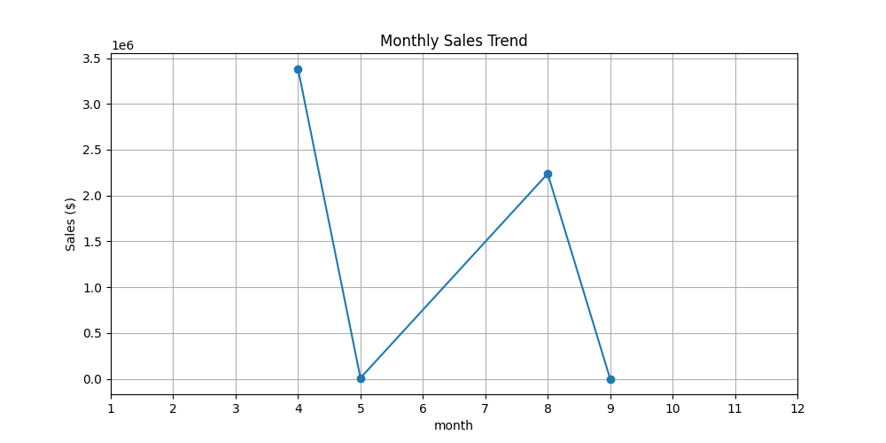
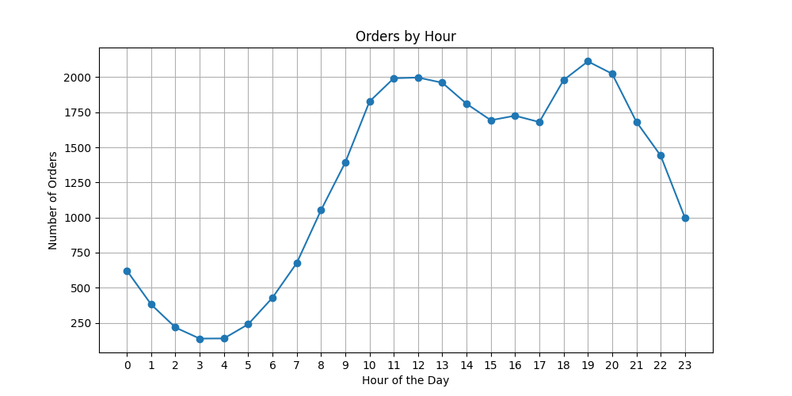
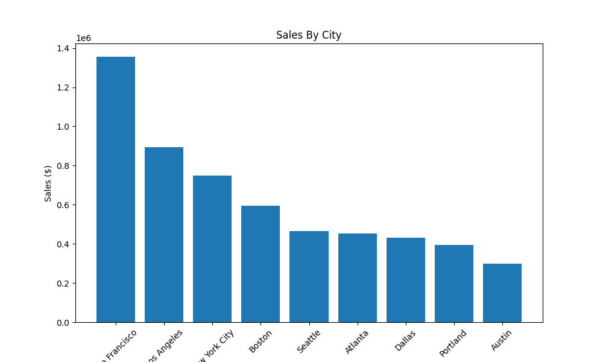
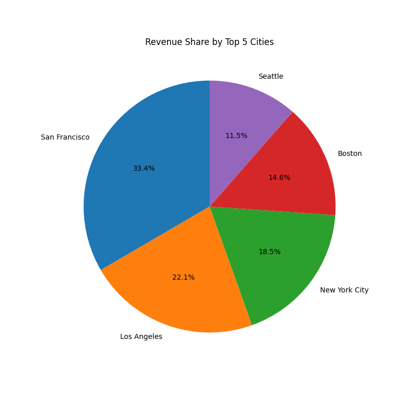
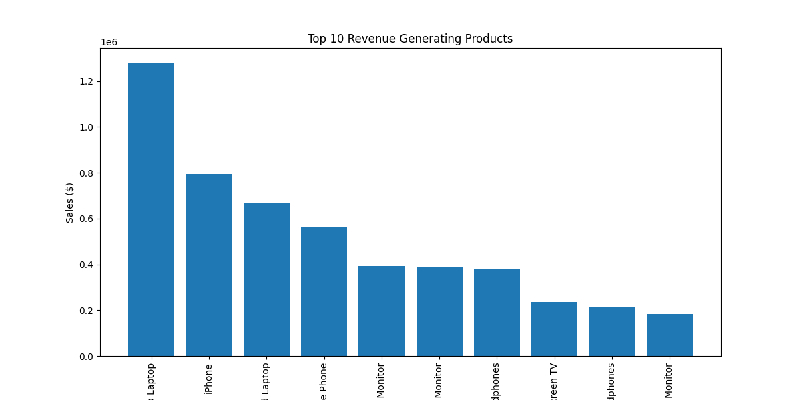
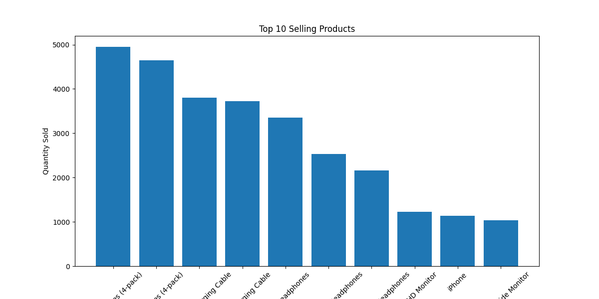
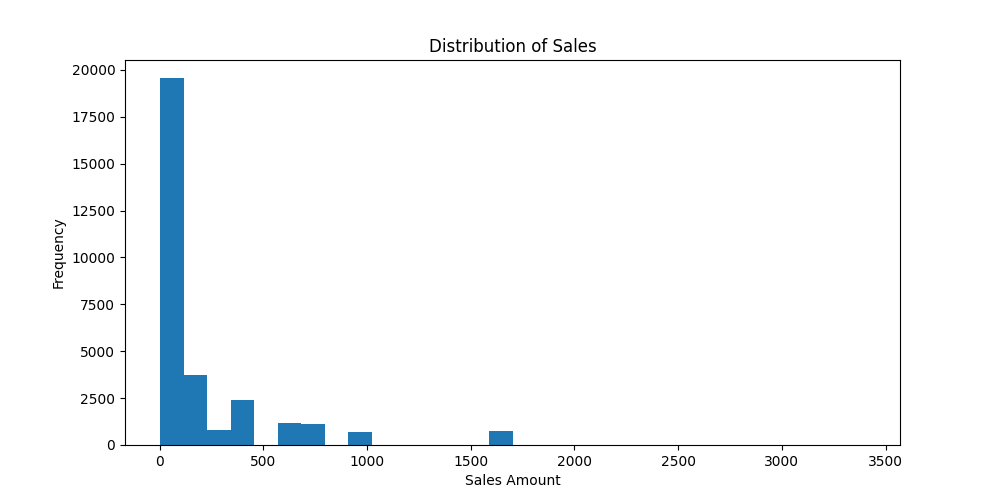

#  Ecommerce Sales Analytics

A comprehensive data analytics project focused on e-commerce transaction processing, product demand analysis, revenue evaluation, and geographical order tracking.

---

##  Visual Analytics & Chart Previews

### 1.  Time-Series & Order Peak Analysis
| Monthly Sales Trend | Peak Order Hours |
| :---: | :---: |
|  |  |
| *Sales volume fluctuations across operating months* | *Order frequency by hour of day (peaks at 11–12 AM & 6–7 PM)* |

### 2.  Geographical Sales Distribution
| Sales Volume by City | Top 5 Cities Revenue Share |
| :---: | :---: |
|  |  |
| *Total revenue generated per city (San Francisco leading)* | *Percentage share of top revenue-generating metropolitan areas* |

### 3.  Product Demand & Revenue Performance
| Top 10 Revenue Generating Products | Top 10 Selling Products by Quantity |
| :---: | :---: |
|  |  |
| *Products generating the highest total revenue ($)* | *Most ordered products by total units sold* |

### 4.  Sales Value Distribution

*Histogram showing the distribution of individual order transaction amounts*

---

##  Project Overview
This project cleanses and analyzes large-scale e-commerce transaction data to help online retailers optimize inventory management, understand city-wise purchasing power, and determine peak ordering hours.

---

##  Key Analytical Areas & Insights
* **Order Volume & Revenue:** Calculation of total sales volume (`Quantity Ordered × Price Each`).
* **Time-Series Sales Trends:** Analyzing daily and monthly purchasing peaks to align marketing campaigns.
* **Peak Purchase Hours:** Identifying optimal advertising windows around 11:00 AM–12:00 PM and 6:00 PM–7:00 PM.
* **Geographical Distribution:** Parsing purchase addresses to identify high-revenue cities like San Francisco, Los Angeles, and New York City.
* **Product Performance:** Dissecting high-volume items (batteries, charging cables) vs. high-revenue drivers (MacBook Pro, iPhone).

---

##  Tools & Technologies Used
* **Data Processing & Cleaning:** Python (Pandas, NumPy) / CSV Processing
* **Data Visualizations:** Matplotlib, Seaborn (Sales Trend Analysis, Product & City Breakdown, Histograms, Pie Charts)
* **Workbook:** Jupyter Notebook (`Ecommerce_Sales_Analytics-3.ipynb`)

---

##  Repository Structure
```
Ecommerce Sales Analytics/
│── Ecommerce_Sales_Analytics-3.ipynb  <-- Complete Jupyter Notebook Analysis
│── clean_sales_data.csv              <-- Cleaned E-commerce Transaction Data
│── Updated_sales.csv                <-- Augmented Sales Dataset with Processed Fields
│── city_sales.png                   <-- Sales by City Bar Chart
│── monthly_sales_trend.png          <-- Monthly Sales Trend Line Chart
│── orders_by_hour.png               <-- Peak Orders by Hour Line Chart
│── sales_distribution.png           <-- Transaction Value Distribution Histogram
│── top5_city_pie.png                <-- Top 5 Cities Revenue Share Pie Chart
│── top_products.png                 <-- Top 10 Products by Quantity Bar Chart
│── top_revenue_products.png         <-- Top 10 Revenue Generating Products Bar Chart
└── README.md                         <-- Project Documentation
```
