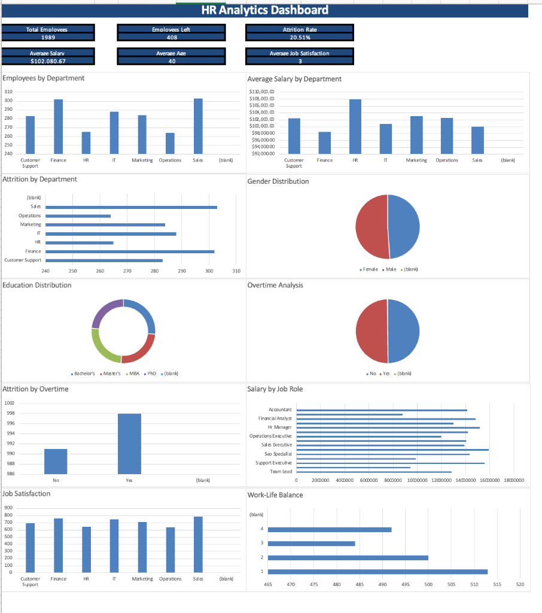

# 👥 HR Analytics Dashboard & Workforce Insights

An interactive **Human Resources (HR) Analytics Dashboard** built in **Microsoft Excel** to monitor employee attrition, salary distributions, performance ratings, and workforce demographics.

---

## 📊 Dashboard Visual Preview



---

## 📌 Project Overview
Human resource retention and workforce satisfaction directly impact operational efficiency and recruitment expenditures. This project analyzes a dataset of **1,989 employees** across multiple departments to identify attrition drivers, evaluate compensation benchmarks, and provide actionable recommendations to executive leadership.

---

## 📊 Key Performance Indicators (KPIs) & Findings
* **Total Employees:** `1,989`
* **Employees Left (Attrition):** `408 employees`
* **Attrition Rate:** `20.51%`
* **Average Employee Salary:** `$102,080.67`
* **Average Employee Age:** `40 years`
* **Average Job Satisfaction Score:** `3 / 5`

---

## 💡 Business Insights & Strategic Recommendations

1. **Departmental Attrition Hotspots:**
   * *Insight:* Attrition is concentrated in the **Sales** and **Finance** departments, followed by IT and Marketing.
   * *Recommendation:* Conduct targeted exit interviews, review commission structures, and introduce retention bonuses and career progression frameworks within high-turnover departments.

2. **Compensation & Salary by Job Role:**
   * *Insight:* Average salary across the organization is **$102,080.67**, with highest compensation observed in specialized roles like **SEO Specialist**, **HR Manager**, and **Financial Analyst**.
   * *Recommendation:* Continuously benchmark compensation against tech/corporate industry standards to prevent key talent drain.

3. **Overtime & Work-Life Balance:**
   * *Insight:* Employees working overtime exhibit significantly higher attrition rates compared to regular-hour staff. Work-life balance ratings skew heavily toward lower satisfaction bands.
   * *Recommendation:* Re-evaluate workload distribution, optimize staffing headcount, and establish flexible work options to prevent burnout.

4. **Demographics & Education:**
   * *Insight:* Balanced gender distribution (Male/Female) across departments, with workforce qualification primarily composed of Bachelor's and Master's degree holders.
   * *Recommendation:* Maintain equitable hiring practices and establish continuous learning & development programs.

---

## 🛠️ Tools & Technologies Used
* **Data Visualization & Analytics:** Microsoft Excel (Pivot Tables, Dynamic Charts, Slicers, KPI Cards)
* **Data Processing:** Data Cleaning, Formula Modeling (VLOOKUP/XLOOKUP, COUNTIFS, AVERAGEIFS)

---

## 📁 Repository Structure
```
HR Analytics Dashboard/
│── HR_Employee_Dataset_2000_Rows 4.xlsx   <-- Complete Excel Workbook (Raw Data, Pivots, Dashboard, Insights)
│── dashboard_preview.png                 <-- Authentic Dashboard Screenshot
└── README.md                              <-- Project Documentation
```
