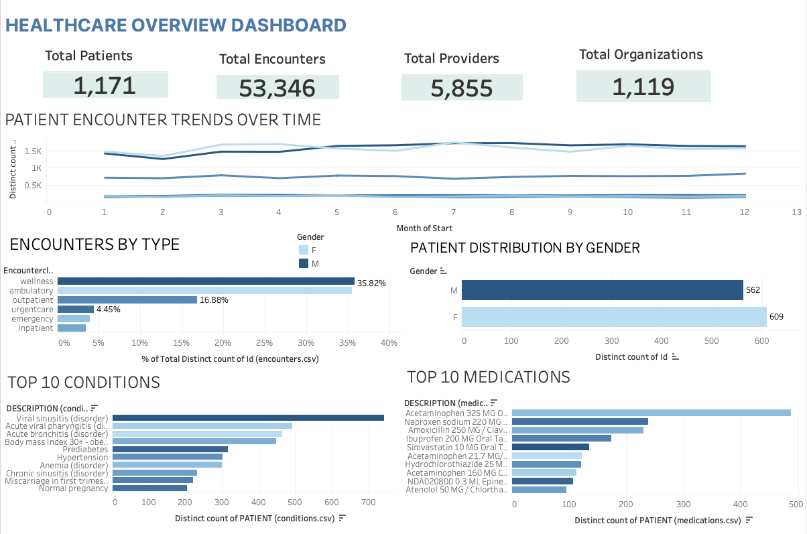
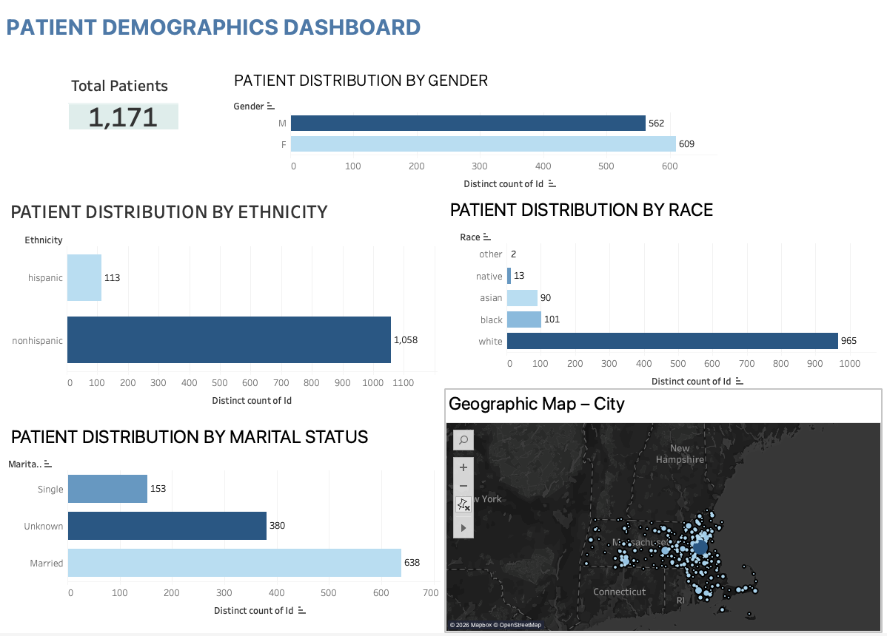
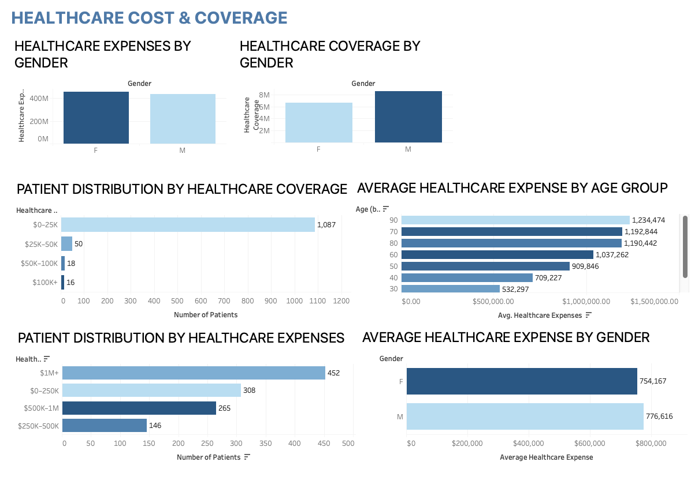

# 📊 Data Analytics Portfolio

Welcome to my Data Analytics Portfolio! This repository showcases real-world analytics projects focusing on **Healthcare Patient Analytics**, **Business Intelligence**, **Financial Analytics**, **HR Workforce Analytics**, and **Commercial Sales Optimization**.

Each project features full-featured workbooks/datasets, relational database schemas, interactive dashboards, KPI summaries, and actionable business insights.

---

## 🎨 Featured Dashboards At A Glance

### 1. 🏥 Healthcare & Patient Analytics Dashboards
* **Dashboard 1: Executive Healthcare Overview**
  [](./Healthcare-Patient-Analytics)
* **Dashboard 2: Patient Demographics & Geographic Distribution**
  [](./Healthcare-Patient-Analytics)
* **Dashboard 3: Healthcare Cost & Financial Coverage**
  [](./Healthcare-Patient-Analytics)

### 2. 👥 HR Analytics & Workforce Dashboard
[](./HR%20Analytics%20Dashboard)

### 3. 🏦 Banking Transaction Analytics Dashboard
[](./Banking%20Transaction%20Analysis)

### 4. 🏬 Retail Sales Performance Dashboard
[](./Retail%20Sales%20Dashboard)

---

## 🚀 Featured Projects Overview

| Project | Domain | Tools & Methods | Key Focus / Highlights |
| :--- | :--- | :--- | :--- |
| 🏥 [**Healthcare Patient Analytics**](./Healthcare-Patient-Analytics) | Healthcare & Clinical BI | MySQL, Python, SQLAlchemy, Pandas | 53K+ encounters, 1,171 patients, 42K+ medications, ETL pipeline & clinical analytics |
| 👥 [**HR Analytics Dashboard**](./HR%20Analytics%20Dashboard) | HR & Workforce | Excel, Pivot Tables, HR Metrics | 1,989 workforce dataset, 408 attrition tracking, $102k avg salary & satisfaction metrics |
| 🏦 [**Banking Transaction Analysis**](./Banking%20Transaction%20Analysis) | Financial Analytics | MySQL, Excel, Pivot Tables, SQL | 117K+ transactions, 115K customers, ₹184M volume & Mumbai/Delhi concentration |
| 🏬 [**Retail Sales Dashboard**](./Retail%20Sales%20Dashboard) | Retail & E-Commerce | Excel, Dynamic Charts, Slicers | $7.63M revenue, $2.27M profit, 955 orders, South region peak & rep performance |
| 🛒 [**Ecommerce Sales Analytics**](./Ecommerce%20Sales%20Analytics) | E-Commerce Analytics | Python, Pandas, CSV Processing | Order trend analysis, product demand profiling & geographical sales distribution |

---

## 📁 Repository Organization

```
Data Analytics Project/
├── 🏥 Healthcare-Patient-Analytics/     <-- Healthcare ETL, Patient Records, Conditions & Medication Analytics
├── 👥 HR Analytics Dashboard/          <-- Workforce Attrition, Compensation & Satisfaction Analytics
├── 🏦 Banking Transaction Analysis/    <-- Banking KPIs, Regional Activity & Account Analytics
├── 🏬 Retail Sales Dashboard/          <-- Retail Revenue, Category Profit & Rep Performance
├── 🛒 Ecommerce Sales Analytics/       <-- E-commerce Sales Trends & Order Analysis
├── .gitignore                          <-- Git exclusion rules
└── README.md                           <-- Main Portfolio Overview
```

---

## 🛠️ Technical Stack & Skills Demonstrated
* **Analytics & DB Tools:** MySQL, Relational Schema Design, Python (Pandas, NumPy, SQLAlchemy, PyMySQL), Microsoft Excel (Pivot Tables, Dynamic Charts, Slicers, KPI Cards, Advanced Formulas).
* **Data Core:** ETL Engineering, Data Cleaning, Data Transformation, Exploratory Data Analysis (EDA), Aggregation.
* **Business Acumen:** Executive KPI reporting, Healthcare Clinical Metrics, Root Cause Attrition Analysis, Regional Revenue Modeling, High-Net-Worth Customer Profiling.

---

## 📬 Contact & Connect
Thank you for visiting my analytics portfolio! Feel free to reach out to discuss data analytics opportunities or project collaborations.
