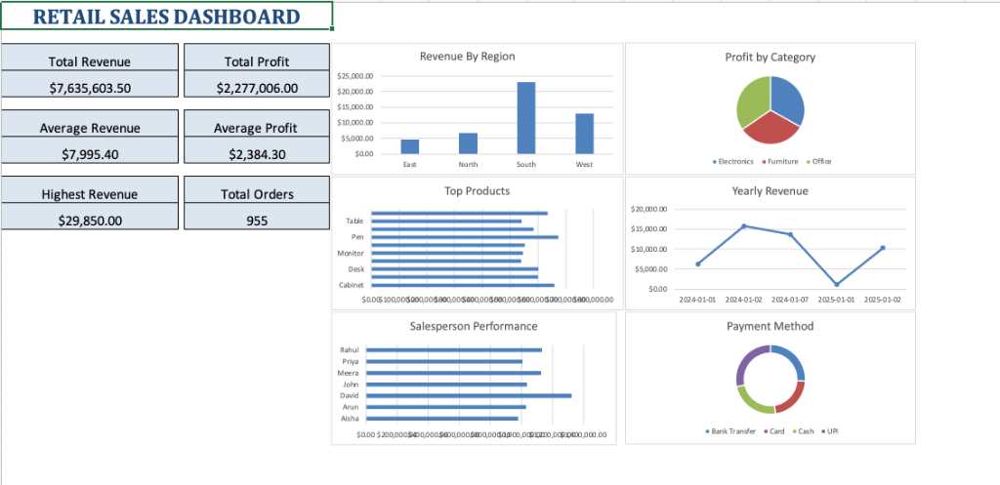

# 🏬 Retail Sales Dashboard & Commercial Analytics

A dynamic **Retail Sales Analytics Dashboard** developed in **Microsoft Excel** to track sales performance, regional revenue generation, product category profitability, and sales representative contributions.

---

## 📊 Dashboard Visual Preview



---

## 📌 Project Overview
Understanding product demand, customer payment preferences, and regional revenue growth is vital for retail strategy. This project processes raw retail sales order data into interactive pivot models and dashboard visuals to guide inventory planning, promotional timing, and sales rep recognition.

---

## 📊 Key Performance Indicators (KPIs) & Metrics
* **Total Revenue:** `$7,635,603.50`
* **Total Profit:** `$2,277,006.00`
* **Average Revenue per Order:** `$7,995.40`
* **Average Profit per Order:** `$2,384.30`
* **Highest Single Revenue Order:** `$29,850.00`
* **Total Orders Processed:** `955`

---

## 💡 Key Business Insights & Recommendations

1. **Regional & Category Drivers:**
   * *Insight:* The **South Region** generated the highest total revenue among all regions (South, West, North, East), while **Electronics** delivered the highest profit margins.
   * *Recommendation:* Expand product variety in the Electronics category and allocate a higher marketing budget to the South region.

2. **Salesperson Performance & Product Insights:**
   * *Insight:* **David** emerged as the top-performing sales representative. **Pen**, **Cabinet**, and **Table** were among the highest demand products.
   * *Recommendation:* Recognize top sales talent and share David's sales strategy across the team. Maintain optimal inventory buffer levels for high-demand products.

3. **Payment Method Preference:**
   * *Insight:* Customer payments are distributed across **Bank Transfer**, **Card**, **Cash**, and **UPI**, with Card and Bank Transfer leading total transaction volume.
   * *Recommendation:* Continue offering seamless digital payment integrations and card promotion discounts.

---

## 🛠️ Tools & Technologies Used
* **Data Analysis & Dashboarding:** Microsoft Excel (Dynamic Pivot Tables, Slicers, KPI Cards, Excel Charts)
* **Data Structuring:** Data Cleaning, Categorization, and Summary Aggregations

---

## 📁 Repository Structure
```
Retail Sales Dashboard/
│── Sales Data-2.xlsx    <-- Complete Excel Workbook (Raw Sales Data, Analysis, Pivots, Dashboard, Insights)
│── dashboard_preview.png <-- Authentic Dashboard Screenshot
└── README.md            <-- Project Documentation
```
